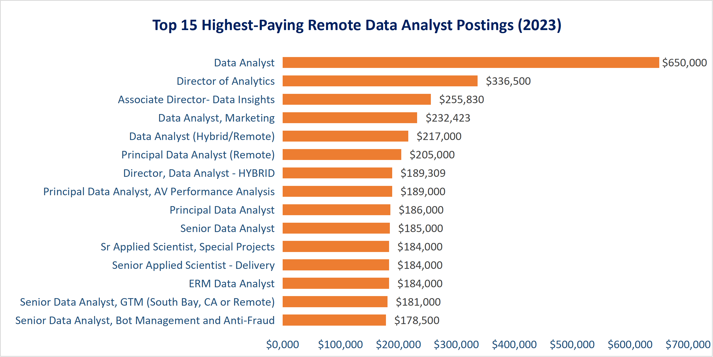
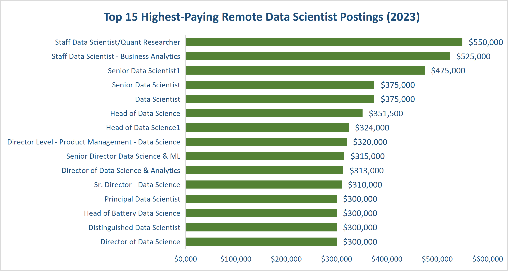
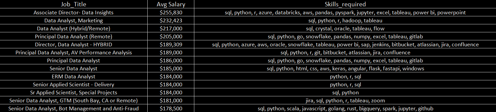
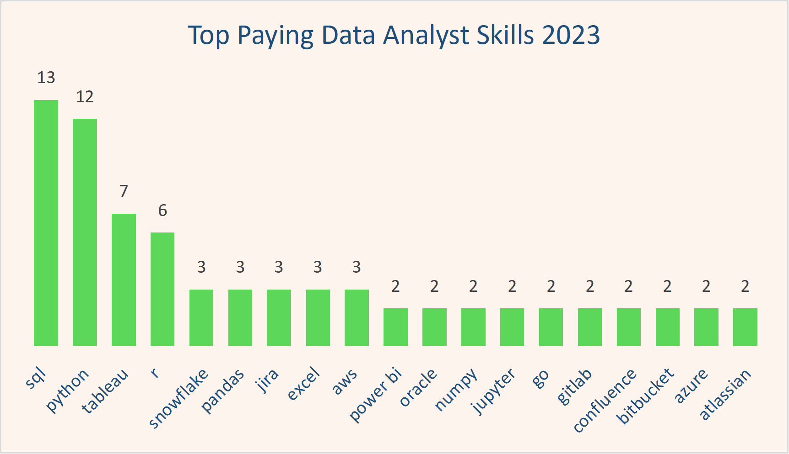
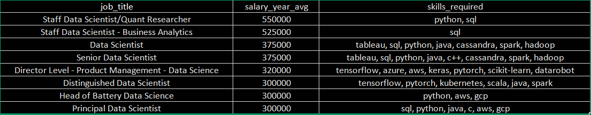
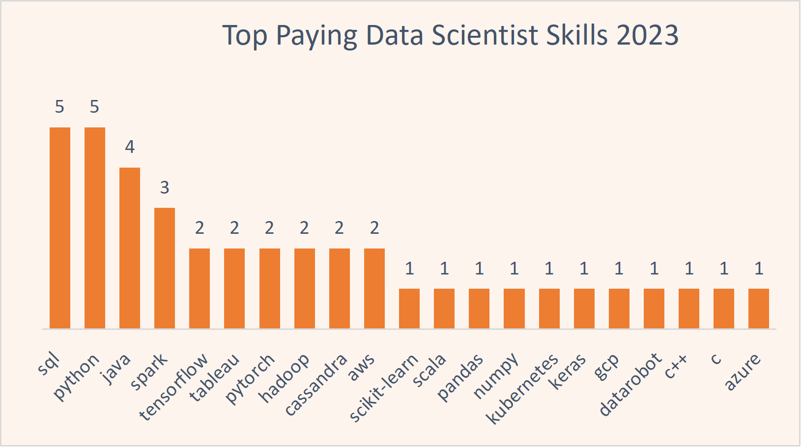
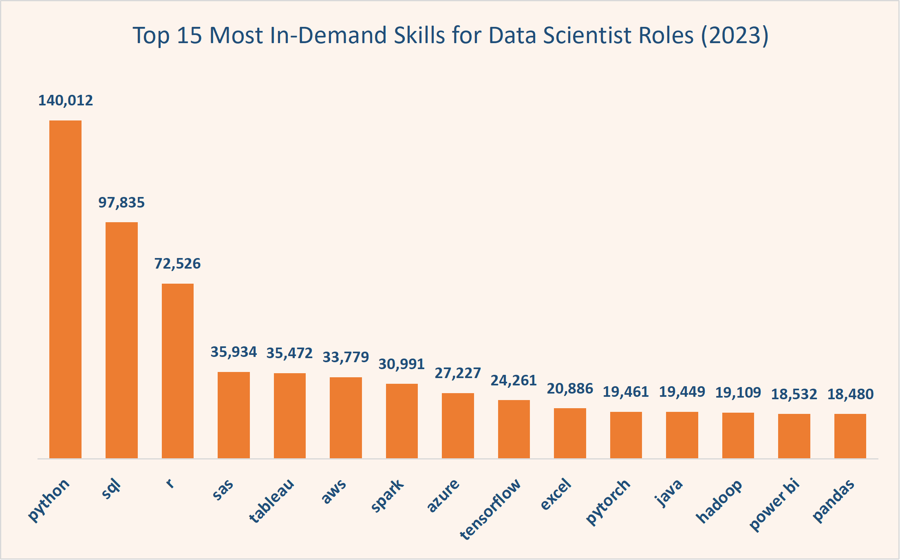
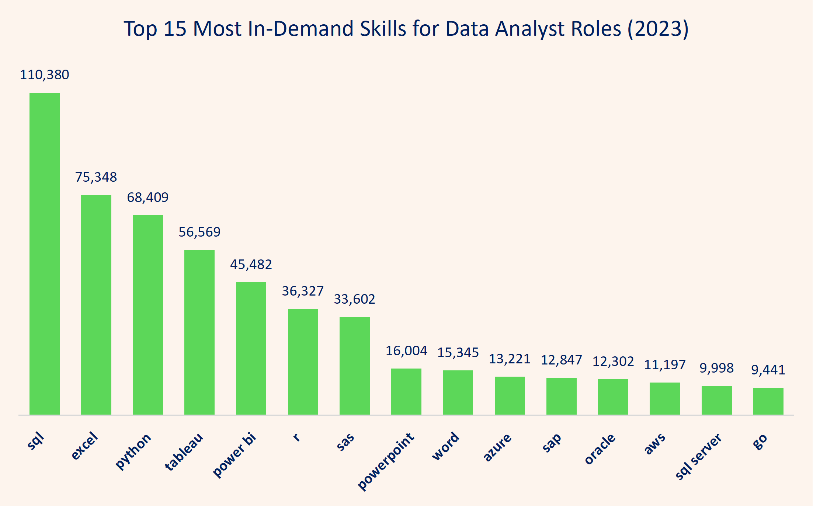

# 2023 Data Analyst & Data Scientist Job Market Analysis

This project analyzes 2023 Data Analyst and Data Scientist job postings to explore trends in salary, remote work, technical skills, and career growth across both roles.

Using SQL (PostgreSQL) and Excel, the analysis compares market demand, compensation patterns, and the technical skills most associated with high-paying opportunities in the modern data industry.

# Problem Statement
With the growing demand for data professionals,identifying which roles and technical skills offer the strongest career opportunities can be challenging but increasingly important.

 This project explores 2023 Data Analyst and Data Scientist job postings to understand how salaries, remote work, and technical skills differ across both roles. It focuses on identifying the skills and technologies most connected to strong career growth and higher-paying opportunities.

To achieve this, the analysis answers the following key questions:

- How many job opportunities existed for Data Analysts vs Data Scientists in 2023?
- How prevalent were remote opportunities for both roles?
- How do salaries compare between remote and non-remote positions?
- What are the highest-paying remote Data Analyst and Data Scientist jobs?
- What skills are required for these top-paying roles?
- What skills are most in demand across both roles?
- What are the most optimal skills to learn (high demand + high salary)?

# Dataset

The complete dataset used for this analysis can be accessed here:
[Download Dataset](https://drive.google.com/file/d/1o5bdYPYn2Ukoc9TBqIwm4AQPj-eJOwze/view?usp=sharing)
# Tools I used 
This project leverages SQL (PostgreSQL) and Excel to analyze the 2023 job postings for Data Analysts and Data Scientists:

- **SQL (PostgreSQL)** – The primary tool used to query job postings, calculate averages, percentages, and identify high-demand skills. Advanced SQL queries were used to compare remote vs non-remote jobs, role-specific salaries, and skills associated with top-paying positions.
- **Excel** – Used to create charts and graphs from query results, providing visual insights that complement the numerical analysis.
- **Power BI**:used for  Data visualization (salary distributions, skill comparisons, scatterplots)

# Key Insights

## 1.   Number of Data Analyst and Scientist roles compared to other data roles in 2023

  
  

  - Data Analyst and Data Scientist roles make up **55.31%(435,684 )**
 of the total data job postings **(787,686)**, indicating that Data Analyst and Data Scientist roles dominated the job market in 2023.

- Data Analyst roles make up 225,882 postings, slightly higher than Data Scientists (209,802, ~8% difference).

- Only 15% of these postings were senior-level, suggesting a more competitive market for advanced positions.”

## 2. Rate of Data Analyst and Scientist Remote Jobs

  

- **Remote Work is Limited Across Data Roles**:

Non-remote roles overwhelmingly dominate the job market, with remote positions making up only a small share of postings for both Data Analysts and Data Scientists.
The distribution of remote roles is similar across both roles, indicating no strong preference for remote work between them.

- **Slight Remote Advantage for Data Scientists**:

Data Scientists have a marginally higher share of remote roles (9%) compared to Data Analysts (7%).
This suggests that more technical or specialized roles may offer slightly greater flexibility.

- **Implications for Job Seekers**:

The large gap between remote and non-remote jobs suggests organizations still rely heavily on location-based teams.
As a result, remote roles are more competitive, requiring stronger or more specialized skill sets.

## 3. Salary Analysis between Roles 

  
  

##### Some postings did not disclose salary information, meaning the salary analysis reflects only jobs with available compensation data.

- **Role-based Salary Differences/Disparity**

Data Scientist roles offer 42% - 52% higher salary than Data Analysts suggesting strong market demand and reward for advanced analytical and machine learning capabilities.

- **Remote Salary Impact Varies by Role**    
Remote salary advantages are stronger for Data Scientist roles (**+8.29%, ~ +$11,926**) than for Data Analysts (**+1.48%, ~ +$1,438**), suggesting that higher compensation increasingly rewards technical specialization and advanced skill sets.

- **Salary Distribution in 2023 Job Postings**
Most Data Analyst and Data Scientist job postings fall within the $80K–$200K salary range, suggesting relatively consistent pay structures across both roles.
However, Data Scientists show greater salary variation and stronger long-term earning potential indicating stronger long-term career progression.

## 4. Top paying Remote Roles 

### For Data Analysts Roles 

### For Data Scientist Role

  

#### ** Some job postings did not include salary information, which may have slightly affected the overall salary analysis and averages.**

#### 1. Salary Trends & Earnings Distribution
- Data Scientists show much stronger earning potential overall, with multiple roles exceeding $500K and more consistent salary growth, while Data Analysts peak significantly lower, typically around $180K–$255K, even at senior and director levels with only rare high-paying outliers.
#### 2. Market Structure & Hiring Channels

- Data Analyst opportunities  are more commonly sourced directly from companies and are strongly tied to enterprise and operational teams while many top-paying Data Scientist roles are sourced through specialist recruitment firms focused on AI, quantitative research, and advanced analytics.
- High-paying remote opportunities are largely concentrated in the United States, highlighting the country’s dominance in the remote data job market.

## 5. Top Remote Paying Skills

### For Data Analyst Roles

  
  

### For Data Scientist Roles

  
  

#### ** Some top-paying job postings did not include associated skill information, meaning certain high-value skills may be omitted or underrepresented in this analysis.**

-  Python and SQL are the most common skills across top-paying Data Analyst and Data Scientist roles.
- High-paying Data Scientist roles emphasize advanced and specialized skills, such as machine learning frameworks, cloud platforms, and big data technologies while Data Analyst roles focus on business intelligence, reporting, and operational analytical skills .
- The highest-paying opportunities across both roles combine technical depth, cloud technologies, and business impact rather than relying on a single tool or skill.

## 6. General In-Demand skills for both roles 

  
  

- SQL and Python are the most essential foundational skills for both roles.
However, SQL dominates Data Analyst postings, while Python dominates Data Scientist postings.
- Data Analyst roles show stronger demand for business intelligence and reporting-focused tools such as Excel, Tableau, Power BI, SAP, and Oracle, highlighting their focus on  operational analytics and business reporting.
- Data Scientist roles show strong demand for programming, machine learning, and scalable computing technologies such as TensorFlow, PyTorch, Spark, Hadoop, AWS, Azure alongside some analytical and reporting tool such as Excel,Power Bi.

 
## 7. Most Optimal Skills to Learn

  
  

- High-paying Data Analyst roles are evolving beyond traditional reporting into analytics engineering and cloud-enabled workflows, with strong demand for skills such as SQL, Snowflake, Databricks, Pandas, Power BI, and Tableau. 

- Top-paying Data Scientist roles emphasize scalable machine learning systems, cloud infrastructure, and distributed computing technologies such as Python, TensorFlow, Spark, BigQuery, and AWS.
- Across both career paths, salary growth is increasingly tied to cloud technologies, scalable data platforms, technical versatility, and the ability to combine analytics with business impact.

# What I Learned 
Through this project, I strengthened my SQL skills by working with aggregations, joins, CTEs, window functions, and more advanced analytical queries across large datasets.

I also learned how to:

- aggregate and structure skill data using functions like STRING_AGG()
- compare trends across salary, demand, remote work, and technical skills
- transform raw job posting data into meaningful business insights
- communicate findings more effectively through charts and data storytelling

This project improved both my technical querying skills and my ability to interpret market trends from data.
# Conclusion 
This project compared Data Analyst and Data Scientist roles across salary trends, remote work opportunities, technical skill demand, and long-term career growth in the 2023 job market.

The analysis showed that while both roles share core skills such as SQL and Python, Data Scientist roles generally offer stronger salary growth, stronger remote opportunities, and greater long-term earning potential. In contrast, Data Analyst roles remain highly in demand and provide a strong entry point into the data industry through business intelligence and operational analytics.

One key finding was how strongly compensation was linked to technical specialization, particularly in areas related to cloud technologies, machine learning, and scalable data systems.

Overall, this project strengthened both my SQL and analytical thinking skills by helping me move beyond querying data into interpreting market trends, comparing patterns, and communicating insights through data storytelling.
